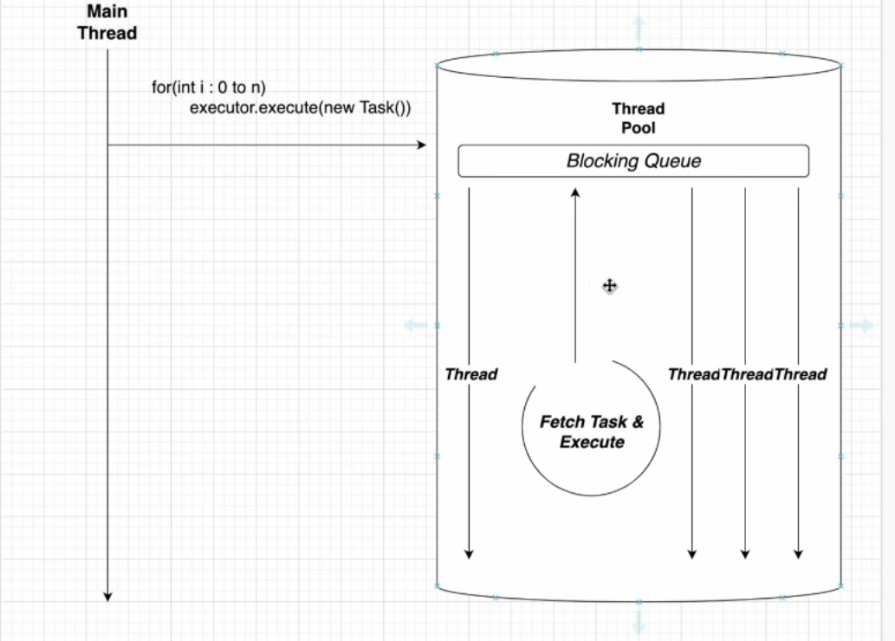

## Locks in java
In Java, a lock ensures that only one thread at a time can execute a piece of code.

This is needed because:
    - Multiple threads might access the same variable (counter)
    - Without protection → race conditions (wrong values)

``` java
private synchronized static void increment() {
    counter++;
}
```

Here the method marked as synchronized and java does this:
- before executing the method acquire a lock
- after finishing release the lock

So if one thread is inside of the method it makes any other thread trying to call it must wait.


What `synchronized` does in Java
ensures that only one thread at a time can execute a block/method
and uses an internal monitor lock (mutex)


### Two types of locks

1. Intristic lock(synchronized)
``` java
synchronized (lockObject) {
    // critical section
} 
```
automatic lock/unlock
simple but less flexible

2. Explicit locks (ReentrantLock)
``` java

Lock lock = new ReentrantLock();

lock.lock();
try {
    counter++;
} finally {
    lock-unlock();
}
```
more control: tryLock() fairness interruptible

#### Example in other languages
``` c#
private static object lockObj = new object();

lock (lockObj) 
{
    counter++;
}

// Modern C#
async Task MyFunction() {
    await Task.Delay(1000);
}
// this is not thread it is more like js async
```

| Feature       | Java                | C#                     |
| ------------- | ------------------- | ---------------------- |
| Basic lock    | `synchronized`      | `lock`                 |
| Advanced lock | `ReentrantLock`     | `Monitor`, `Mutex`     |
| Threads       | `Thread`            | `Thread`, `Task`       |
| Async         | `CompletableFuture` | `async/await`|


_Code example_

``` c#
using System;
using System.Collections.Generic;
using System.Threading;
using System.Threading.Tasks;


public class ParkingLot
{

    private readonly int _capacity;
    private int _occupiedSpots;
    private decimal _totalRevenue;


    // Shared state of the parking lot
    private readonly HashSet<string> _parkedCars = new();
    private readonly HashSet<string> _carsInPayment = new();

    // 1) Baisc lock
    // protects shared data like occupied spots and parked cars
    private readonly object _parkingLock = new();

    // 2) Advanced Lock
    // Only 2 payment terminals can be used at the same time
    private readonly SemaphoreSlim _paymentTerminals;

    // 3) Thread:
    // a real background thread that prints monitor info
    private readonly Thread _monitorThread;
    private bool _monitorRunning;

    public ParkingLot(int capacity, int paymentTerminalCount) 
    {
        _capacity = capacity;
        _paymentTerminals = new SemaphoreSlim(paymentTerminalCount, paymentTerminalCount);

        _monitorThread = new Thread(MonitorLoop)
        {
            IsBackground = true
        };
    }


    public void StartMonitor() 
    {
        _monitorRunning = true;
        _monitorThread.Start();
    }


    public void StopMonitor() 
    {
        _monitorRunning = false;
        _monitorThread.Join();
    }


    public bool TryEnterCar(string plate) 
    {

        // Basic lock
        // only one thread at a time can change parking data

        lock (_parkingLock)
        {
            if (_occupiedSpots >= _capacity)
            {
                Console.WriteLine($"{plate} could not enter. Parking is full.");
                return false;
            }

            if (_parkedCars.Contains(plate))
            {
                Console.WriteLine($"{plate} is already inside.");
                return false;
            }


            _parkedCars.Add(plate);
            _occupiedSpots++;

            Console.WriteLine($"{plate} entered. Occupied: {_occupiedSpots}/{_capacity}");
            return true;
        }
    }

    public async Task ExitAndPayAsync(string plate, int parkedHours)
    {
        decimal fee = parkedHours * 2.50m;

        // First reserve this car for payment so it does not exit twice
        lock (_parkingLock)
        {
            if (!_parkedCars.Contains(plate)) {
             Console.WriteLine($"{plate} is not in the parking lot.");
                return;
            }

            if (_carsInPayment.Contains(plate))
            {
                Console.WriteLine($"{plate} is already paying.");
                return;
            }

         _carsInPayment.Add(plate);   

        // Advanced Lock + Async;
        // (SemaphoreSlim allow n threads at the same time)
        // only 2 cars may use payment terminals at once,
        // and waiting here does not block a thread
        await _paymentTerminals.WaitAsync();

        try {
            Console.WriteLine($"{plate} started payment on thread {Environment.CurrentManagedThreadId}.");

            // Async
            // simulates waiting for card terminal / external payment service
            await Task.Delay(Random.Shared.Next(1000, 2500));
            lock (_parkingLock) {
                _carsInPayment.Remove(plate);

                if (_parkedCars.Remove(plate))
                {
                    _occupiedSpots--;
                    _totalRevenue += fee;

                    Console.WriteLine($"{plate} paid {fee:C} and left. Occupied: {_occupiedSpots}/{_capacity}");
                }
            }
        }
        finally 
        {
            _paymentTerminals.Release();
        }

    }

    // monitorThread it runs independently and prints parking status every 1.5 seconds
    private void MonitorLoop()
    {
        while (_monitorRunning)
        {
            string snapshot;

            // BASIC LOCK again:
            // monitor reads shared state safely
            lock (_parkingLock)
            {
                snapshot =
                    $"[MONITOR THREAD {Environment.CurrentManagedThreadId}] " +
                    $"Free spots: {_capacity - _occupiedSpots}, " +
                    $"Parked: {string.Join(", ", _parkedCars)}, " +
                    $"Revenue: {_totalRevenue:C}";
            }

            Console.WriteLine(snapshot);
            Thread.Sleep(1500); // real blocking sleep on the monitor thread
        }
    }
}

    public class Program
    {
        public static async Task Main() 
        {
            public static async Task Main()
            {
                ParkingLot parkingLot = new ParkingLot(capacity: 3, paymentTerminalsCount: 2);

                parkingLot.StartMonitor();

                // Simulate multiple cars entering at the same time
                // Thread pool threads
                Task[] entryTasks = {
                    Task.Run(() => parkingLot.TryEnterCar("SG-101")),
                    Task.Run(() => parkingLot.TryEnterCar("SG-102")),
                    Task.Run(() => parkingLot.TryEnterCar("SG-103")),
                    Task.Run(() => parkingLot.TryEnterCar("SG-104")) // should be rejected if full
                };

                await Task.WhenAll(entryTasks);

                Console.WriteLine();
                Console.WriteLine("---- Cars are parked for a while ----");
                Console.WriteLine();
                
                await Task.Delay(2000);

                // Simulate multiple cars leaving and paying at the same time
                Task[] exitTasks = {
                    parkingLot.ExitAndPayAsync("SG-101",2);
                    parkingLot.ExitAndPayAsync("SG-102",1)
                    parkingLot.ExitAndPayAsync("SG-103",4)
                };

                await Task.WhenAll(exitTasks);

                Console.WriteLine();
                Console.WriteLine("---- End of simulation ----");
                Console.WriteLine();

                parkingLot.StopMonitor();
            }
        }
    }
}

```


### Producer-Consumer
_Is a pattern that is used for teaching the synchronization in java_

```text
            buffer
Producer => |-----| <= Consumer
```

``` java
import java.util.LinkedList;
import java.util.Queue;

class SharedBuffer {
    private final Queue<Integer> queue = new LinkedList<>();
    private final int capacity = 5;

    public synchronized void produce(int value) throws InterruptedException {
    
        // wait if full
        while (queue.size() == capacity) {
            wait();
        }

        queue.add(value);
        System.out.println("Produced: " + value);

        notify(); // wake up consumer 
    }

    public synchronized int consume() throws InterruptedException {
        // wait if empty
        while (queue.isEmpty()) {
            wait();
        }

        int value = queue.remove();
        System.out.println("Consumed: "+value);

        notify(); // wake up producer
        return value;
    }

}
```


### Executors
In Java, Executors are part of java.util.concurrent and they solve a big problem:
“Don’t manually manage threads — let a pool handle them efficiently.”



``` java
new Thread(() -> doWork()).start();

ExecutorService executor = Executor.newFixedThreadPool(3);
executor.submit(() -> doWork());
// Threads are reused
// Better performance 
// Easier controll
```
Main types are:
1. Fixed Thread Pool
2. Cached Thread Pool
3. Single Thread Executor
4. Scheduled Thread Pool
