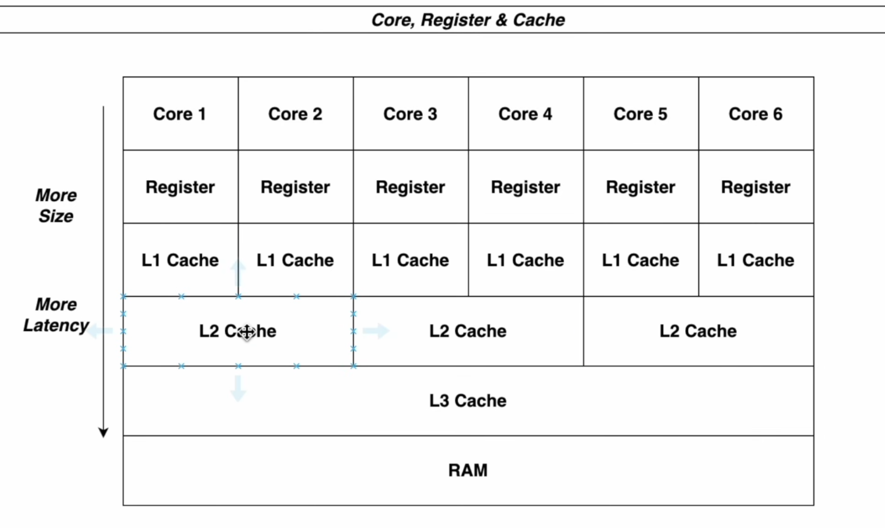
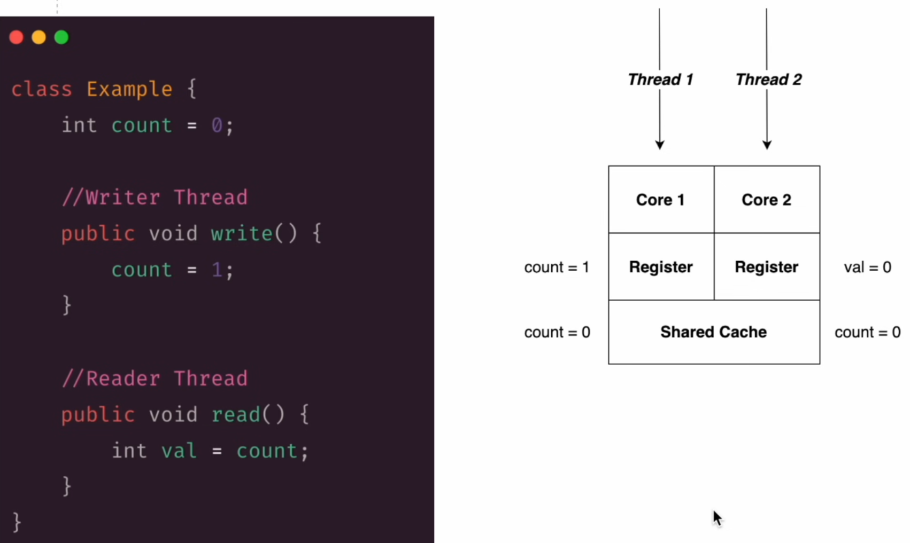

### Lock fairness

Non-fair-lock
// ReentrantLock lock = new ReentrantLock();
this is usually faster, but thread that just arrived may get the lock before older waiting threads.
Fait lock 
// ReentrantLock lock = new ReentrantLock(true);

``` java
import java.util.concurrent.locks.ReentrantLock;

public class FairnessExample {
    private static ReentrantLock lock = new ReentrantLock(true); // fair lock

    public static void main(String[] args) {
        Runnable task = () -> {

            String name = Thread.currentThread().getName();
            lock.lock();
            try {
                System.out.println(name + "got the lock");
                try {
                    Thread.sleep(1000);
                } catch (InterruptedException e) {
                    Thread.currentThread().interrupt();
                }
                finally {
                    System.out.println(name + "releases the lock");
                    lock.unlock();
                }
            };

            for (int i = 1; <= 3; i++) {
                new Thread(task, "Thread-"+i).start();
            }
        }
    }
}
```

`tryLock()` behaves like this:
``` java
if (lock.tryLock()) {
    // success → got the lock
} else {
    // failed → immediately returns false
}
```
Important point:
- It tries only once
- If the lock is not available → it does NOT wait
- It does NOT retry automatically

### Visibility problem in java



This picture demonstrates the visibility problem 
The solution for this is a keyword `volatile`


### Deadlock in multithreading
this occurs when two or more threads are blocked forever each waiting for other thread to release a resource they need to proceed. This situation creates acycle of dependencies with no thread able to continues with its execution.

``` java
// Bad code
public class DeadLockDemo {
    private final lock LockA = new ReentrantLock(true);
    private final lock LockB = new ReentrantLock(true);

    public void workerOne() {
        lockA.lock();
        System.out.println("Worker Ine acquired LockA");
        try {
            Thread.sleep(200);
        } catch (InterruptedException e) {
            throw new RuntimeException(e);
        }
        lockB.lock();
        System.out.println("Worker One acquired lockB");
        lockA.unlock();
        lockB.unlock();
    }

    // Here it requires a lockB for processing but it is already used by the workerOne() 
    public void workerTwo() {
        lockB.lock();
        System.out.println("Worker Ine acquired LockB");
        try {
            Thread.sleep(200);
        } catch (InterruptedException e) {
            throw new RuntimeException(e);
        }
        lockA.lock();
        System.out.println("Worker One acquired lockA");
        lockA.unlock();
        lockB.unlock();
    }

    public static void main(String[] args) {
        DeadLockDemo demo = new DeadLockDemo();
        // new Thread(() -> demo.workerOne(), "WorkerOne").start();
        new Thread(demo::workerOne, "WorkerOne").start();
        new Thread(demo::workerTwo, "WorkerTwo").start();
        
        new Thread(() -> {
            ThreadMXBean mxBean = new ManagementFactory.getThreadMXBean();
            while (true) {
                long[] threadIds = mxBean.findDeadlockedThreads();
                if (threadIds != null) {
                    System.out.println("Deadlock detected.");

                    //ThreadInfo[] threadInfo = mxBean.getThreadInfo(threadIds);

                    for (long threadId: threadIds) {
                        System.out.println("Thread with ID" + threadId + "is in DeadLock");
                    }
                    break;
                }
                try {
                    Thread.sleep(5000);
                }
                catch (InterruptedException e) {
                    throw new RuntimeException (e);
                } 
            }
        }).start();
    }
}
```

_How to prevent the deadlocks?_
1. Use Timeouts
2. Global ordering of locks
3. Avoid nesting of locks
4. Use Thread safe alternatives

``` java
// 1. Example
import java.util.concurrent.locks.ReentrantLock;
import java.util.concurrent.TimeUnit;

ReentrantLock lock = new ReentrantLock();

if (lock.tryLock(2, TimeUnit.SECONDS)) {
    try {
        System.out.println("God the lock");
    } finally {
        lock.unlock();
    }
    else {
        System.out.println("Could not get the lock, avoiding deadlock");
    }
}

// 2. Example
// Always acquire locks in the same order. no circular waiting
Object lockA = new Object();
Object lockB = new Object();

void safeMethod() {
    synchronized (lockA) {
        synchronized (LockB) {
            System.out.prinln("Safe execution");
        }
    }
}

// 3. Example
// Bad (nested locks → risk of deadlock)
synchronized (lockA) {
 synchronized (lockB) {
        System.out.println("Nested locking");
    }   
}

// Good example
// Better (split work)
synchronized (lockA) {
    System.out.println("Wotj with A");
}

synchronized (lockB) {
    System.out.println("Wotj with B");
}

// 4. Example
// Use thread-safe alternatives
import java.util.concurrent.ConcurrentHashMap;
ConcurrentHashMap<String, Integer> map = new ConcurrentHashMap();

map.put("key", 1);
map.compute("key", (k, v) -> v + 1);

System.out.println(map.get("key"));
// No synchronized, no deadlock risk
```

### Semaphores
A Semaphore is a synchronization tool that controls how many threads can access a resource at the same time.

Think of it as a counter of permits:
- If permits > 0 → a thread can enter
- If permits = 0 → thread must wait
- When a thread finishes → it releases a permit

_Basic idea_
Only a specific n number of thread can use/run at the same time

``` java
import java.util.concurrent.Semaphore;

public class SemaphoreExample {
    private static final Semaphore semaphore = new Semaphore(2);

    public static void main(String[] args) {
        Runnable task = () -> {
            String name = Thread.currentThread().getName();

            try {
                System.out.prinln(name + "waiting...");
                semaphore.acquire();

                System.out.println(name + "got access");

                Thread.sleep(2000); // simulation of the work

                System.out.println(name + " done");
                } catch (InterruptedException e) {
                    Thread.currentThread().interrupt();
                } finally {
                    semaphore.release();
                }
            };

            for (int i = 1; i <= 5; i++) {
                new Thread(task, "Thread-" +i).start();
            }
        }
// Only 2 threads run at once
// others wait until a permit is released
}
```
Concept	Java	C#
Semaphore	Semaphore	Semaphore / SemaphoreSlim
acquire()	acquire()	Wait() / WaitAsync()
release()	release()	Release()


### Mutex
A Mutex (short for mutual exclusion) is a synchronization primitive that allows only ONE thread at a time to access a resource.
``` text$
Semaphore → allows N threads
Mutex     → allows ONLY 1 thread
```

Concurrency is: Task overlap in time, but don’t necessarily run simultaneously
- one Cpu can switch between task
. uses context switching
``` text
Task a -> run a bit
Task b -> run a bit 
Task a -> continue
Task b -> continue
```
Looks “simultaneous” but actually takes turns

Parallelism is: Task run literally at the same time
- requires multiple CPU cores
``` text
Core 1 -> Task A
Core 2 -> Task B
```
True simultaneous execution
``` java
import java.until.stream.IntStream;

IntStream.range(0,5).parallel().forEach(i -> {
    System.out.println("Task " + i + " running in " + Thread.currentThread().getName());
});
// Runs on multiple threads → multiple cores
```
