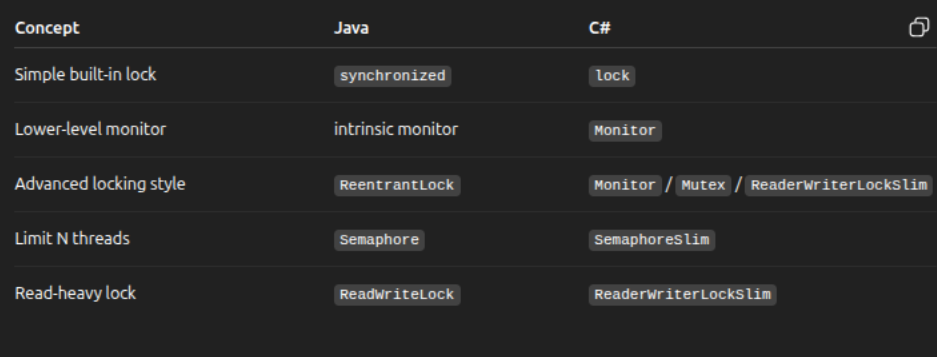
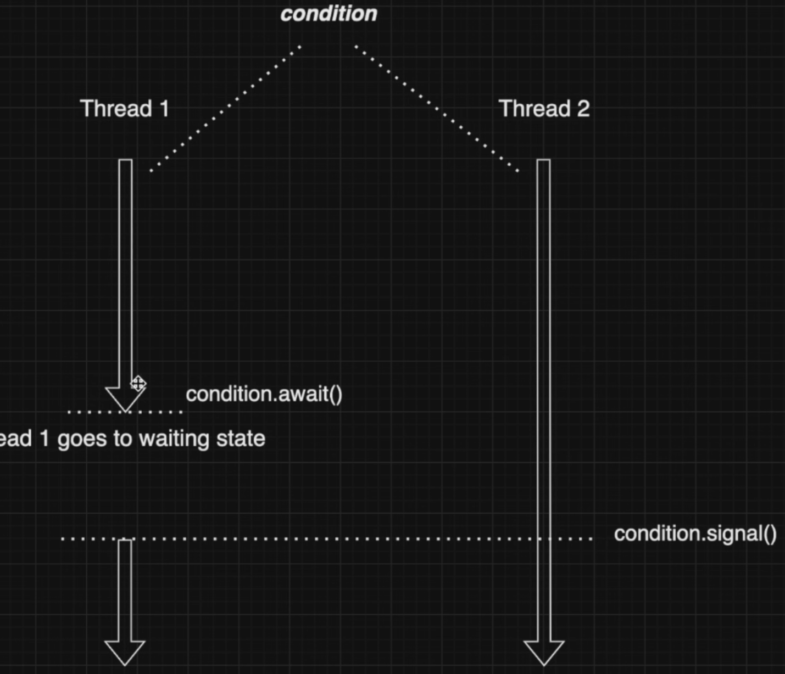

## I/O Operations

I/O operations (like file reads, network calls, database queries), the trade-offs are a bit different than with pure CPU work. The key idea is:

- I/O is usually slow and waiting, not busy computing.
- So using threads can help—but also hurt if misused.

_Prons of using Threads with I/O_

1. Better responsiveness
    If one thread is waiting on I/O, others can keep working.

    ``` text
    Thread A -> waiting for HTTP response
    Thread B -> continues processing
    So the app dont freezes
    ```
2. Parallel I/O (higher throughput)

    You can run multiple I/O operations at the same time:
    - Download multiple files concurrently
    - Query multiple services in parallel


_Cons of using Threads with I/O_

1. Threads are expensive

Each thread:
    - consumes memory (stack)
    - has scheduling overhead

If you create too many threads (e.g., 1000+ I/O calls):

performance drops
system can become unstable

2. Blocking is wasteful
Typical threaded I/O:
``` c#
var data = File.ReadAllText(path); // block the thread
```
Here thread just sits there doing nothing while waiting.
THis is inefficient compared to async I/O, where no thread is used during the wait


### Synchronized Collections
Most of the java collections are not tread safe
Way to make collections thread safe
    use Collcetions.synchronized() method
    use the concurrent collections which are synchronized

Downsides of using the Collections.synchronized() approach
    Coarse grained locking
    Limited functionality
    No Fail Fast Interators
    Performane Overhead

### CountDownLatch in Java is a synchronization tool

Think of it like a gate that stays closed until a counter reaches zero.
    You start with a number (the “count”)
    Each time a task finishes → it calls countDown()
    When the count hits 0 → the gate opens
    All waiting threads continue

``` java
import java.util.concurrent.CountDownLatch;

public class Example {
    public static void main(String[] args) throws InterruptedException {
        CountDownlatch latch = new CountDownLatch(3);

        Runnable worker = () -> {
            System.out.println(Thread.currentTread().getName() + "working...");
            try {
                Thread.sleep(1000); 
            } catch (InterruptedException e) {}

            System.out.println(Thread.currentThread().getName() + "done");
            latch.countDown()M
        };


        new Thread(worker).start();
        new Thread(worker).start();
        new Thread(worker).start();

        System.out.prinln("Main thread waiting...");
        latch.wait(); // waits until count = 0

        System.out.println("All workers finished!");

    }
}
```

### Main difference between Join() CountDownLatch

join() → wait for a specific thread to finish
CountDownLatch → wait for a group of events/threads (flexible control)

1. join() (Thread-based waiting)
``` java
Thread t = new Thread(() -> {
    System.out.println("Working...");
});

t.start();
t.join(); // wait for THIS thread only

System.out.println("Done");
```
Main thread blocks until t finishes
Direct connection: one thread waits for another

2. CountDownLatch (event-based waiting)
```java
CountDownLatch latch = new CountDownLatch(3);

new Thread(() -> { latch.countDown(); }).start();
new Thread(() -> { latch.countDown(); }).start();
new Thread(() -> { latch.countDown(); }).start();

latch.await(); // wait for ALL 3
```
Waiting thread blocks until counter = 0
No need to know which threads exactly

_Modern C# twist_
In real world c# i dont use the `CountdownEvent`
but instead: await Task.WhenAll(task1, task2, taks3);

``` c#
var tasks = new List<Task>();

for (int i = 0; i < 3; i++)
{
    tasks.Add(Task.Run(async () => {
        await Task.Delay(1000);
        Console.WriteLine("Done");
    }));
}

await Task.WhenAll(tasks);
Console.WriteLine("All done!");
```

## Blocking Queue
Introduction to Blocking Queue
What is a Queue? it is data structure where elements are usually processed in this order:
FIFO First in First out

A BlockingQueue is a special queue for multithreading.
It is designed so that threads can safely put data in and take data out.

The word blocking means:
- if a thread wants to take an element but the queue is empty, it can wait
- if a thread wants to put an element but the queue is full, it can wait

So instead of crashing or constantly checking in a loop, the thread just pauses until the operation becomes possible.

put() / take() are the strongly “blocking” ones
offer() / poll() are the softer, safer “try” versions

``` java
import java.util.concurrent.ArrayBlockingQueue;
import java.util.concurrent.BlockingQueue;

public class Main {
    public static void main(String[] args) {
        BlockingQueue<String> queue = new ArrayBlockingQueue<>(2);

        Thread producer = new Thread(() -> {
            try {
                queue.put("Order 1");
                System.out.println("Produced: Order 1");

                queue.put("Order 2");
                System.out.println("Produced: Order 2");

                queue.put("Order 3"); // waits if queue is full
                System.out.println("Produced: Order 3");
            } catch (InterruptedException e) {
                e.printStackTrace();
            }
        });

        Thread consumer = new Thread(() -> {
            try {
                Thread.sleep(2000);

                System.out.println("Consumed: "+queue.take());
                Thread.sleep(2000);

                System.out.println("Consumed: " + queue.take());
                Thread.sleep(2000);
                System.out.println("Consumed: "+queue.take());
            } catch (InterruptedException e) {
                e.printStackrace();
            }
        });

        producer.start();
        consumer.start();
    }
}
// Why this way is better because it eliminats need to use the `synchjronized`, wait() notifyAll() this is just another layer of the abstraction
```

### Concurrent Map 
A thread-safe version of a Map (like HashMap), designed for concurrent access.


A normal Hashmap: One big stracture -> one lock (if synchronized)
bad for concurrency

ConcurrentHashMap: Split into parts -> multiple threads can work in parallel

_Old modeld before java 7_
used `segment` before by devinding whole map
like [Segment 0] [Segment 1] [Segment 2] [Segment 3]
it like mini HashMap, and has it own lock

_Modern way java 8+_
removed the segments, and uses now Array of nodes (buckets)
``` text
// Modern INSERT (put) flow
1. hash(key)
2. find bucket index
3. if empty → CAS insert (no lock)
4. if not empty → lock bucket
5. insert/update
6. unlock
```

``` text
// Modern GET flow
1. hash(key)
2. find bucket
3. traverse nodes
4. return value
```

why this is powerful
because it requires less locking 
code example:
``` java
import java.util.concurrent.ConcurrentHashMap;

public class ConcurrentMapExample {

    private static final ConcurrentHashMap<String, Integer> map = new ConcurrentHashMap<>();

    public static void main(String[] args) {

        
        Thread t1 = new Thread(() -> {
            String key = "apple";

            Integer value = map.get(key); // locks free here many threads can do this at the same time
            if (value == null) {
                System.out.println("Thread 1: value not found, putting...");
                map.put(key, 1); // sometimes lock-free sometimes locks a samll parts(bucktes)
            }
        });

        Thread t2 = new Thread(() -> {
            String key = "apple";

            // Atomic: only one thread computes, waits or reuses the others
            Integer value = map.computeIfAbsent(key, k -> {
                System.out.println("Thread 2: computing value...");
                return 10;
            });

            System.out.println("Thread 2 got: " + value);
        });

        // Atomic: lock buckets read value apply function update value unlock
        Thread t3 = new Thread(() -> {
            String key = "apple";

            map.compute(key, (k, v) -> {
                System.out.println("Thread 3: updating value...");
                return (v == null) ? 1 : v + 1;
            });
        });

        t1.start();
        t2.start();
        t3.start();
    }
}
```

### Exchanger
An Exchanger lets two threads swap data with each other.

Thread A gives something
Thread B gives something
→ they exchange values

``` java
import java.util.concurrent.Exchanger;

public class ExchangerExample {

    public static void main(String[] args) {

        Exchanger<String> exchanger = new Exchanger<>();

        Thread t1 = new Thread(() -> {
            try {
                String data = "Data from Thread 1";
                System.out.println("Thread 1 sends: "+data);

                String received = exchanger.exchange(data);
                System.out.println("Thread 1 received: " + received);
            }
            catch (InterruptedException e) {
                e.printStackTrace();
            }
        });

        Thread t2 = new Thread(() -> {
            try {
                String data = "Data from Thread 2";
                System.out.println("Thread 2 received: "+received);
            }
            catch (InterruptedException e) {
                e.printStackTrace();
            }
        });
        t1.start();
        t2.start();
    }
}
```


### Copy and Write Array
"Instead of changing the current shared version directly, create a new copy, change that copy, then replace the old code"
this is why it feels similar to the git branches.
e.x: when working wiht git
`main` is one state, i create a branch, cahnges files there, then later that becomes another version/snapshot
so like the git does niot mutate the old commit, it creates a new commit snapshot.

`CopyOnWriteArrayList`
when a thread writes: it dont not modify the urrent shared array in place, it creats a new array
changes that new array then swaps the reference 


### What is Locks in java?
A lock is a mechanism that ensures only one thread can access a critical section at a time.
why lock are important
1. Mutual exclusion
Onyl one thread isnide cirtical section
1. Data consistancy
Only data is not corrupted
3. visibility
Cahnges made by one thread are visible to others

_Two ways in java and c#_
1. synchronized (build-in) or in c# 
``` c#
lock(obj) {
    counter++;
}
```
That is the closest direct equivalent
---

2. lock from (java.until.concuirent.locks)$
``` java
Lock lock = new ReentrantLock();

lock.lock();
try {
    counter++;
}
finally {
    lock.unlock();
}
```


Difference between the synchronized Block vs Locks.
The sync block has less manual controll equating the locks



``` java
class ConditionBuffer {
    private final Queue<Integer> queue = new LinkedList<>();
    private final int capacity;

    private final ReentrantLock lock = new ReentrantLock();
    private final Condition notFull = lock.newCondition();
    private final Condition notEmpty = lock.newCondition();

    public ContidionBuffer(int capacity) {
        this.capacity = capacity;
    }

    public void produce(int value) throws InterruptedException {
        lock.lock();
        try {
            while (queue.size() == capacity ) {
                System.out.println("Producer waits: buffer is full");
                notFull.await();
            }

            queue.add(value);
            System.out.println("Produced: "+value+"| queue = "+ queue);

            notEmpty.signal();
        }
        finally {
            lock.unlock();
        }
    }

    public int consume() throws InterruptedException {
        lock.lock();
        try  {
            while (queue.isEmpty()) {
                System.out.prinln("Consumer waits: buffer is empty";
                    notEmpty.await();
                )
                int value = queue.remove();
                System.out.println("Consumed: " + value + " | queue = " + queue);
                notFull.signal();
                return value;
            }
            finally {
                lock.unlock;
            }
        }

        public void runDemo() throws InterruptedException {
            Thread producer = new Thread(() -> {
                for (int i = 1; i <= 5; i++) {
                    try {
                        produce(i);
                        Thread.sleep(500);
                    } catch (InterruptedException e) {
                        Thread.currentThread().interrupt();
                    }
                }
            }, "Producer");
        }

        Thread consumer = new Thread(() -> {
            for (int i = 1; i <= 5; i++) {
                try {
                    Thread.sleep(800);
                    consume();
                } catch (InterruptedException e) {
                    Thread.currentThread().interrupt();
                }
            }
        }, "consumer");

        producer.start();
        consumer.start();

        producer.join();
        consumer.join();
    }

}
```

In the Eample i have the shared buffer.
This buffer can be in two problematic states: 
1. full 
2. empty 
so threads somethimes must wait until state changes
and that is where the Condition comes handy 

`Condition` belongs to the lock. 
so the condition is a waiting room attached to a specific lock.

`signal()` does not instantly run the other thread
it only moves one waiting thread from the condition queue toward lock reacquisition
that awakened thread still needs to re-acquire the lock before continuing
_I use Condition only with Lock (e.g. ReentrantLock)_
